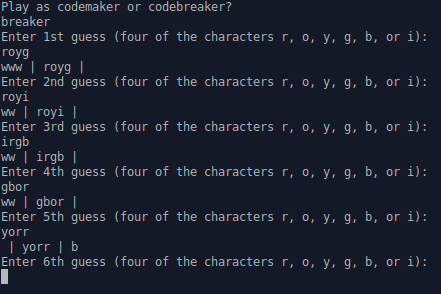

# mastermind
An assignment from [The Odin Project](https://www.theodinproject.com/) to implement a game of hangman.

Additional information can be found at https://www.theodinproject.com/lessons/ruby-mastermind

## How to Play

| <code>ruby game.rb</code>

To play as the codebreaker enter <code>codebreaker</code>, to play as the codemaker enter <code>codemaker</code>

The characters **r**, **o**, **y**, **g**, **b**, and **i** are used to represent coloured pegs.
**w** is used to represent a white peg and **b** a black peg.

| <code>exit</code> can be used at any time to exit

**As a codebreaker**

Input a four character code using the characters **r**, **o**, **y**, **g**, **b**, and **i**.
Feedback is given in the format <code>(white pegs) | (your guess) | (black pegs)</code>, with the number of **w** and **b** characters representing the number of white and black pegs respectively.

If the code is <code>royg</code> and the guess is <code>rbiy</code> the feedback will be <code>ww | rboy | b</code>

**As a codemaker**

As prompted, enter a four character code consisting of the characters **r**, **o**, **y**, **g**, **b**, or **i**.
After each guess the computer provide feedback using up to four characters of **w** and **b**. 
The number of **w** characters is the number of correct pegs in the incorrect position.
The number of **b** characters is the number of correct pegs in the correct position.

If the code is <code>royg</code> and the computer guesses <code>rbiy</code> then the feedback given should be <code>wwb</code>. The order of the **w** and **b** characters doesn't matter.

## Features

- gameplay as both codemaker and codebreaker
- feedback given with white and black pegs when playing as codebreaker
- a simple ai that attempts to guess the code when playing as codemaker

## Technologies
- Written in Ruby.
- Git for version control